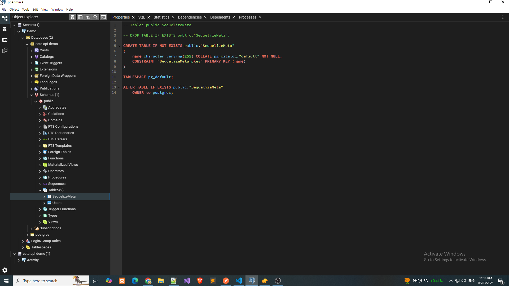
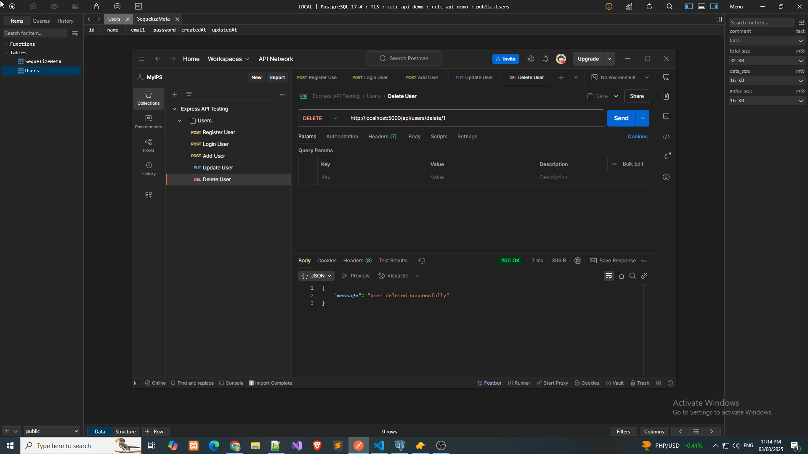
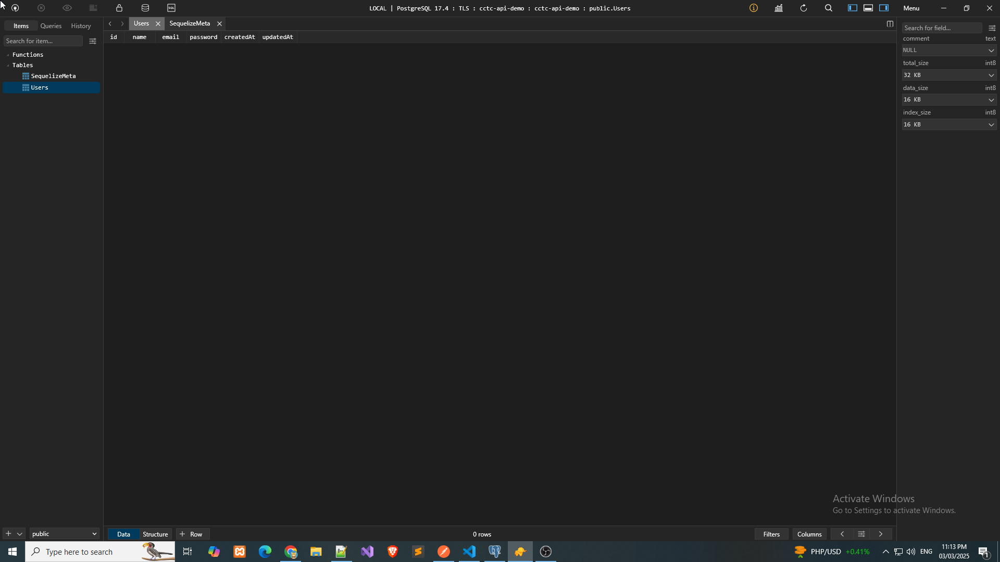

# Express API

This is an Express API project with user registration, login, and CRUD operations.

## Screenshots

### Add User


### Login User


### Postgres


### Postman With Gmail Account


### Postman


### Register User


### TablePlus


### Update User


### Time Completed


## Installation

1. Clone the repository
   ```sh
   git clone https://github.com/yourusername/express-api.git
